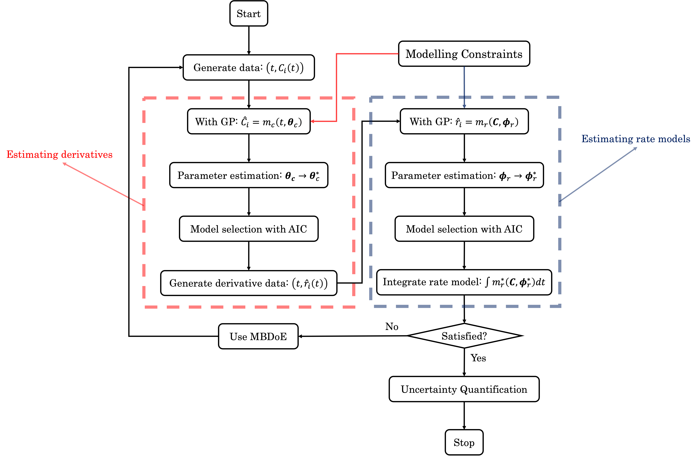
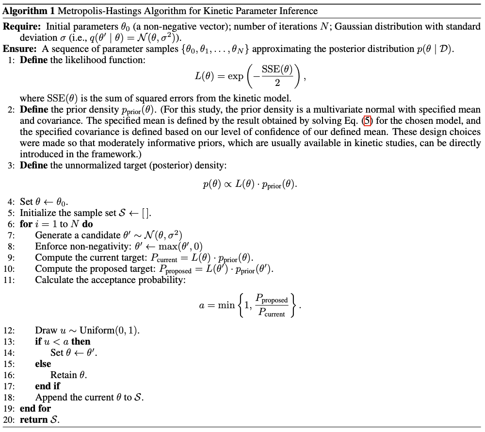

# Constraint-Guided Symbolic Regression for Data-Efficient Kinetic Model Discovery

The industrialization of catalytic processes hinges on the availability of reliable kinetic models for design, optimization, and control. Traditional mechanistic models demand extensive domain expertise, while many data-driven approaches often lack interpretability and fail to enforce physical consistency. To overcome these limitations, we propose the Physics-Informed Automated Discovery of Kinetics (PI-ADoK) framework. By integrating physical constraints directly into a symbolic regression approach, PI-ADoK narrows the search space and substantially reduces the number of experiments required for model convergence. Additionally, the framework incorporates a robust uncertainty quantification strategy via the Metropolis-Hastings algorithm, which propagates parameter uncertainty to yield credible prediction intervals. Benchmarking our method against conventional approaches across several catalytic case studies demonstrates that PI-ADoK not only enhances model fidelity but also lowers the experimental burden, highlighting its potential for efficient and reliable kinetic model discovery in chemical reaction engineering.

> Carvalho Servia, M., Sandoval, I., Hellgardt, K., Hii, K., Zhang, D., & Rio Chanona, E.. (2025). Constraint-Guided Symbolic Regression for Data-Efficient Kinetic Model Discovery. 
https://doi.org/10.48550/arXiv.2507.02730


## Methodology

<details>
<summary>Click to expand</summary>

### Notation

We begin by establishing the mathematical notation necessary to precisely describe our methodology. First, we adopt the standard symbolic regression formulation, which serves as the foundation before introducing the strong formulation of our approach.

Let the set $\mathcal{Z}$ be defined as the union of an arbitrary collection of constants, $\Gamma$, and a fixed set of variables, $\mathcal{X}$. The operator set $\mathcal{P}$ consists of both arithmetic operations ($\diamond: \mathbb{R}^n \rightarrow \mathbb{R}$) and a finite collection of special one-dimensional functions ($\Lambda: \mathbb{R} \rightarrow \mathbb{R}$). Through iterative function composition using the operators in $\mathcal{P}$ over the elements in $\mathcal{Z}$, we form the model search space $\mathcal{M}$.

In our framework, variables are represented as state vectors $x \in \mathbb{R}^{n_x}$. Each data point comprises a state $x$ and its corresponding target value $y \in \mathbb{R}$ generated by an unknown function $f: \mathbb{R}^{n_x} \rightarrow \mathbb{R}$, such that $y = f(x)$. Collectively, the dataset is given by $\mathcal{D} = \lbrace \left( x^{(i)}, y^{(i)} \right) \mid i = 1, \ldots, n_t \rbrace$. To measure the discrepancy between predictions and target values, we employ a suitable positive-valued function $\ell: \mathbb{R}^{n} \times \mathbb{R}^{n} \rightarrow \mathbb{R}^{+}$.

A symbolic model $m \in \mathcal{M}$ is characterized by a finite set of parameters $\theta_m$, whose dimensionality $d_m$ depends on the specific model. We denote the model's prediction under parameters $\theta_m$ as $m(\cdot \mid \theta_m)$, and we represent the predicted value by $\hat{y}_m$ (i.e., $\hat{y}_m = m(\cdot \mid \theta_m)$). Crucially, our approach has two phases, which emulates well a bi-level optimization problem: the first phase (or inner problem) where the main objective is to find the optimal model structure, and the second (or outer problem) where the main objective is to fine-tune the optimal model structure and discover its optimal parameters. We define the optimal model $m^*$ as the model that minimizes the sum of the data fitting error and a penalty term proportional to the degree of constraint violation. Formally, this is expressed as:

$m^* = \arg\min_{m \in \mathcal{M}} \lbrace \sum_{i=1}^{n_t} \ell \left( \hat{y}_m^{(i)}, y^{(i)} \right) + \sum_{j=1}^{J} \lambda_j \, P_j(m) \rbrace,$

where $P_j(m)$ quantifies the violation of the $j$-th constraint, $\lambda_j$ is a constant scaling factor specific to that constraint, and $J$ is the total number of constraints.

The corresponding optimal parameters are determined by

$\theta_{m^*}^* = \arg\min_{\theta_{m^*}} \lbrace\sum_{i=1}^{n_t} \ell\left( \hat{y}_{m^*}^{(i)}, y^{(i)} \right) + \sum_{j=1}^{J} \lambda_j \, P_j(m)\rbrace.$

In the context of dynamical systems, the state variables are functions of time, $x(t) \in \mathbb{R}^{n_x}$, representing the evolution of the system over a fixed interval $\Delta t = [t_0, t_f]$. The system dynamics are characterized by the time derivatives $\dot{x}(t) \in \mathbb{R}^{n_x}$ and the initial condition $x_0 = x(t_0)$.

For our kinetic rate models, we assume that the $n_t$ sampling times $t^{(i)}$ lie within the interval $\Delta t$. The concentration measurements $C$ at each time $t^{(i)}$ approximate the true state $x(t^{(i)})$, while the rate estimates $r$ approximate the corresponding time derivatives, $r^{(i)} \approx \dot{x}(t^{(i)})$. Thus, the dataset becomes $\mathcal{D} = \lbrace \left( t^{(i)}, C^{(i)} \right) \mid i = 1, \ldots, n_t \rbrace.$

As before, we denote model predictions by a hat: $\hat{C}_m$ for states and $\hat{r}_m$ for rates, with the outputs given by $\hat{C}_m(\cdot \mid \theta_m)$ and $\hat{r}_m(\cdot \mid \theta_m)$, respectively.

We quantify the complexity of a model using the function $\mathcal{C}(m)$, here defined as the number of nodes in the expression tree representing the model. Models can then be grouped into families based on their complexity level $\kappa \in \mathbb{N}$, denoted as $\mathcal{M}^\kappa = \lbrace m \in \mathcal{M} \mid \mathcal{C}(m) = \kappa \rbrace.$

This notation establishes the mathematical foundation for our methodology, facilitating a clear and systematic description of our approach to automated kinetic model discovery.

### Introduction to the Strong Formulation
Before getting into the detailed explanations of model generation, model selection, mathematical constraints, and uncertainty quantification, we first provide a concise, itemised workflow of PI-ADoK. This overview will serve as a road-map for the discussion that follows.

1. **Data collection:** Acquire time–series concentrations $\!\bigl(t,\;C_i(t)\bigr)$ of all reactants and products.
2. **Generate constrained concentration surrogates:** Employ genetic programming with embedded physical constraints (positivity, equilibrium,\,\dots) to build differentiable symbolic models $\eta_i(t)$ that fit the measured $C_i(t)$.
3. **Parameter refinement (concentration):** Calibrate every surrogate by solving the second equation shown to obtain $\theta_{\eta_i}^{\star}$.
4. **Model selection (concentration):** Use $\mathrm{AIC}$ to pick the most accurate yet parsimonious $\eta_i(t)$ from the model set for each chemical species in each experiment.
5. **Derivative estimation:** Differentiate the chosen $\eta_i(t)$; the derivatives $\dot{\eta}_i(t)$ provide rate estimates $r_i(t)$.
6. **Generate constrained rate model candidates:** Apply genetic programming with constraints to the rate data, yielding a set $\mathcal M^{\kappa}$ of symbolic rate models for each complexity $\kappa$.
7. **Parameter refinement (rates):** Optimize every rate model by solving the inner problem in the fifth equation shown.
8. **Model selection (rates):} Rank the $\kappa$-winners with $\mathrm{AIC}$ and select the final kinetic expression $m^{\star}$.
9. **Optional MBDoE loop:** If $m^{\star}$ is unsatisfactory and budget remains, use model-based design of experiments to propose new conditions (default: discriminate between the best and second-best rate models), collect data, and return to Step 2.
10. **Uncertainty quantification:** For the accepted model, quantify parameter uncertainty (with Metropolis–Hastings) and propagate it to obtain predictive intervals.

For PI-ADoK, which leverages the strong formulation of symbolic regression, the primary objective is to determine the model $m$ that best maps the state variables $x(t)$ to the corresponding rates $r^{(i)}$, i.e.,

$\hat{r}_m(t \mid \theta_m) = m(x(t) \mid \theta_m).$

Since direct measurements of the rates $r^{(i)}$ are unavailable, they must first be estimated from the concentration data $C^{(i)}$. To this end, our approach constructs an intermediate symbolic model $\eta$ that approximates the concentration measurements, such that $\eta(t^{(i)}) \approx C^{(i)}$. This process follows the standard symbolic regression procedure, as described in the first and second equation shown, with the associated model selection methodology detailed in the below section ("Model Selection").

Overfitting is inherently controlled at two distinct stages of the PI-ADoK workflow. First, during the genetic programming search, the population is arranged by structural complexity $\kappa$. For every admissible dimensionality (e.g.\ $\kappa = 3,4,5,\ldots$) the algorithm independently seeks and stores the best performing model before any cross-complexity comparison is made. This level-wise competition ensures that simple models are never forced to compete directly with much richer expressions and by defining an upper limit of complexity, the search process is prevented from drifting toward unnecessarily intricate solutions. Second, when the set of level-wise winners is compared to choose the final model, we employ the Akaike Information Criterion, which adds an explicit penalty that grows with the dimensionality of the model. By coupling complexity-arranged search with AIC-based selection, PI-ADoK guards against overfitting both during model generation and during the ultimate selection of the governing kinetic expression.

Because the model $\eta$ is differentiable, its derivative, $\dot{\eta}(t^{(i)})$, serves as an approximation for the true rates, i.e., $\dot{\eta}(t^{(i)}) \approx r^{(i)}$. With these rate estimates in hand, we can formulate the optimization problem as follows. At the outer level, we optimize over candidate models of fixed complexity $\kappa$ by minimizing the sum of the fitting error and a penalty term that is proportional to the degree of constraint violation:

$m^\star = \arg\min_{m \in \mathcal{M}^\kappa} \lbrace \sum_{i=1}^{n_t} \ell \left(\hat{r}_m(t^{(i)} \mid \theta_m), r^{(i)}\right) + \sum_{j=1}^{J} \lambda_j \, P_j(m) \rbrace.$

At the inner level, we optimize the parameters of the selected model $m^\star$ as follows:

$\theta_{m^\star}^\star = \arg\min_{\theta_{m^\star}} \lbrace\sum_{i=1}^{n_t} \ell \left(\hat{r}_{m^\star}(t^{(i)} \mid \theta_{m^\star}), r^{(i)}\right) + \sum_{j=1}^{J} \lambda_j \, P_j(m) \rbrace.$

In both the second and fifth equation shown, the function $\ell$ represents the sum of squared errors (SSE). The Limited-memory Broyden-Fletcher-Goldfarb-Shanno (L-BFGS) algorithm is employed for solving the parameter estimation problem. L-BFGS is well-suited for handling this problem due to its performance in tasks pertaining to parameter estimation and optimization. The stopping criteria for the optimization are left to the default options in the Scipy package, and a multi-start approach is employed, where multiple runs are initiated with different starting points, and the best solution is retained. A schematic overview of the complete PI-ADoK workflow is shown below.


Figure 1: Step-by-step flow of PI-ADoK, highlighting the two main tasks: estimating derivatives (red box) and generating rate models (blue box). In the derivative-estimation phase, genetic programming produces candidate concentration models, followed by parameter estimation and model selection via AIC. These models are then numerically differentiated to approximate reaction rates. In the rate-modeling phase, the framework uses the estimated rates to build kinetic expressions, again refining candidates through parameter estimation and model selection. Model-based design of experiments (MBDoE) can propose new experiments to collect data if the current model is unsatisfactory, closing the loop until a reliable model is obtained. Uncertainty quantification is then performed on the final model to assess prediction reliability. Constraints are included in each step of model construction to guide the genetic programming algorithm to physically-sensible models.

The PI-ADoK framework is designed to handle complex chemical reaction scenarios, including cases with multiple reactions occurring in parallel or sequentially. In this work, however, we focus on single-reaction systems. For multi-reaction systems, the approach is significantly different. Instead of deriving a single unified model to describe the kinetic rates of all species, the chemical system would require PI-ADoK to develop individual models for each reactant and product. This is due to the fact that, in multi-reaction systems, the dynamics of each species are governed by distinct mathematical functions, with no direct stoichiometric relationships linking their rates. An example of applying the strong formulation of symbolic regression to multi-reaction systems is provided in the `Supplementary Information' of 
https://doi.org/10.48550/arXiv.2301.11356.


### Model Selection

Having outlined how PI-ADoK produces a level-wise set of candidate models (one best expression for every structural complexity $\kappa$) we now turn to the question of how to choose among those winners.  The selection step must favor models that are predictive yet parsimonious, thereby reinforcing the overfitting defenses already built into the search procedure.

Instead of employing a data-splitting approach for model selection, PI-ADoK leverages an information criterion, allowing the entire dataset to be utilized for both model construction and evaluation. This is particularly beneficial in low-data environments, as it maximizes the amount of information available for identifying suitable kinetic models.

We specifically adopt the Akaike Information Criterion (AIC) based on prior comparative analyses of different information criteria, where AIC consistently demonstrated superior performance in kinetic discovery. Formally, for a model $m$ with parameter set $\theta_m$ of dimension $d_m$, the AIC is given by:

$$\text{AIC}_m = 2 \, NLL\bigl(\theta_m \mid \mathcal{D}\bigr) + 2\,d_m,$$

where $NLL$ denotes the negative log-likelihood . When comparing two models $m_1$ and $m_2$, the one with the lower AIC value from the above equation is deemed preferable.


### Model-Based Design of Experiments

If the dataset used for model discovery is insufficient to yield an adequate model, and provided the experimental budget has not been exhausted, we can leverage insights from the optimized models to design a more informative experiment. In particular, we identify the operating conditions that maximize the discrepancy between the state predictions $\hat x(t|\theta^\star)$ of the two best proposed models, denoted as $\eta$ and $\mu$, based on the current dataset. In this work, the "operating conditions" refer to the initial conditions of an experiment. However, the "operating conditions" can be expanded to included many other variables, both static (e.g., initial temperature, initial pressure, type of catalyst) and dynamic (e.g., heating/cooling profile, rate of reactant addition, rate of product extraction).


The rationale for selecting these two models is discussed in our previous paper. The MBDoE approach adopted in this work follows the framework developed by Hunter and Reiner:

$$x_0^{(new)} = \arg\max_{x_0} \lbrace x_0 + \int_{t_0}^{t_f} \ell\left(\hat x_\eta \left(\tau\mid\theta_\eta^\star \right), \hat x_\mu \left(\tau\mid\theta_\mu^\star \right) \right)\, d\tau \rbrace.$$

In the above equation, $\ell$ represents the SSE. Once the optimal initial conditions are determined, a new experiment can be performed to generate additional data points, which are then incorporated into the original dataset. With this enriched dataset, PI-ADoK can be executed again, thereby closing the loop between informative experimental design and optimal model discovery.


### Integration of Mathematical Constraints

The incorporation of mathematical constraints into symbolic regression frameworks has attracted considerable attention in the literature, yielding mixed outcomes. On one hand, studies such as those by Kronberger (2022) indicate that integrating constraints may lead to higher prediction errors on both training and testing datasets. They attribute this effect to slower convergence rates and a more rapid loss of genetic diversity. Nevertheless, this same study suggest that under elevated noise levels (which often mirror the inherent variability in experimental setups) the benefits of enforcing constraints become more pronounced by steering the search toward models that are consistent with the underlying system.

Further investigations by Haider (2023) extended these observations by examining case studies under conditions of high noise. Their findings indicate that, although the improvements in prediction error were sometimes not statistically significant compared to unconstrained approaches, the incorporation of constraints did help in identifying models with a lower propensity for overfitting and enhanced adherence to expected behavior. In addition, research by Błądek (2019) demonstrates that for smaller datasets (typical of many experimental scenarios) the integration of mathematical constraints can yield statistically significant improvements over traditional genetic programming (GP) algorithms without constraints.

Taken together, these studies, despite their ambiguous outcomes, are encouraging for our application area (of course, this is contingent on having a good underlying discovery algorithm, because without it, constraints will likely provide little added-value). Experimental data are frequently characterized by high noise levels and limited sample sizes, conditions under which the selective enforcement of constraints appears to offer tangible benefits. This suggests that, even if the addition of constraints occasionally incurs a trade-off in prediction accuracy, the overall improvements in physical plausibility and model robustness make this approach a promising avenue for experimental applications like the one we deal with in this work.

Motivated by these findings there is a clear need for a flexible methodology to incorporate extensive prior knowledge (often available in kinetic studies) into GP. PI-ADoK integrates constraints directly into the GP process to ensure that candidate models not only fit the data but also conform to established physical laws.

Integrating constraints into GP is a delicate endeavor that requires balancing exploration and exploitation in a vast search space. On one hand, constraints reduce the search space by eliminating models that violate known physical principles, thus focusing computational effort on promising regions. On the other hand, overly stringent constraints lead to reduced population diversity, which can induce premature convergence, and inevitably results in suboptimal solutions.

In PI-ADoK, constraints are incorporated in a straightforward yet effective manner. Each candidate model is evaluated based on its prediction error and its compliance with a set of predefined constraints. Specifically, our constraints verify that candidate models:

1. Exactly respect the initial conditions (since these are determined with minimal uncertainty).
2. Reach equilibrium so that the function's end behavior converges to a constant value.
3. Consistently predict outputs with the correct sign (e.g., positive concentrations or negative rates).
4. Exhibit the correct monotonic behavior, being either always increasing or always decreasing.

Each of these constraints can be turned on and off independently based on the chemical system being investigated. When a candidate model satisfies all constraints, its fitness is determined solely by its prediction error. However, if it violates one or more constraints, a penalty, which is proportional to the degree of violation and scaled by a user-defined hyperparameter, is added to its fitness. This penalty-based method enables fine-tuning of the balance between allowing some flexibility in the search and enforcing strict constraint adherence through the hyperparameters. It is important to note that these hyperparameters were manually fine-tuned for our experiments. Although a more formal hyperparameter optimization could potentially enhance the robustness of our findings, we believe that these parameters should be tuned on a case-by-case basis, since the appropriate confidence in the constraints depends on the specific system, the amount of available information, and ultimately the performance of the algorithm.

This approach offers several advantages:

- It preserves the interpretability and physical plausibility of the resulting models by ensuring adherence to known physical laws.
- It focuses the search on promising regions of the model space, potentially reducing the experimental cost of model discovery.
- The use of hyperparameters to scale penalty terms allows the algorithm to be tailored to different problem contexts, balancing the need for exploration with the drive for exploitation.

However, it is important to note that our current implementation employs static hyperparameters that remain constant throughout the search process. In future work, it would be worthwhile to investigate dynamic hyperparameter tuning strategies, where the penalty factors evolve during the search. For instance, one might hypothesize that a more relaxed constraint regime in the early stages could maximize diversity and facilitate a broad exploration of the model space. As the search progresses and promising regions are identified, the constraints could gradually become more stringent, thereby focusing computational resources on refining high-performing solutions.


### Uncertainty Quantification Using the Metropolis-Hastings Algorithm

Uncertainty quantification is an important aspect of modeling complex kinetic systems, as it provides insight into the confidence and robustness of predicted model behavior. In the context of symbolic regression, and specifically for PI-ADoK, the need to accurately propagate uncertainty through non-linear, high-dimensional kinetic models have led us to adopt a sampling-based approach using the Metropolis-Hastings (MH) algorithm.

Various methods exist for uncertainty quantification, ranging from simpler techniques such as Laplace approximations and sigma points to more sophisticated sampling algorithms like Hamiltonian Monte Carlo (HMC) and MH. For our purposes of kinetic modeling, where accuracy may be critical, the MH algorithm was selected because of its ability to handle complex, non-linear distributions whilst having a simple and intuitive implementation that provides effective results. This flexibility in choosing proposal distributions makes MH particularly adaptable to the intricate dynamics often encountered in kinetic modeling.

The MH algorithm is an iterative method designed to sample from a target distribution: in our case, the posterior distribution of the model parameters. It works by constructing a Markov chain, meaning that each new sample depends only on the current state, and as the chain evolves, its distribution converges to the target distribution (this convergence is known as the chain reaching its stationary distribution).

At each iteration, a candidate point is generated by perturbing the current point using a proposal distribution. The candidate is then either accepted or rejected based on an acceptance probability. This probability is calculated to satisfy the detailed balance condition, which essentially ensures that the likelihood of moving from one point to another and vice versa is balanced in such a way that the chain will eventually reflect the target distribution.

In our implementation, if the candidate improves the model's fit (i.e., it has a higher posterior probability) or meets the acceptance criterion probabilistically even when it is less likely than the current state, the candidate is accepted and becomes the new current state. If not, the algorithm retains the current state. This process of generating, evaluating, and either accepting or rejecting candidates allows the chain to explore the parameter space effectively. Over many iterations, the samples collected approximate the posterior distribution, providing a robust quantification of uncertainty in our kinetic models.

The main steps of the MH algorithm are summarized in the algorithm below.



</details>

## Code tutorials

<details>
<summary>Click to expand</summary>

### Tutorial for PI-ADoK: Decomposition of Nitrous Oxide
The code presented below serves to give step-by-step instructions on how to execute PI-ADoK. 

#### Import required packages
Below we show the needed packages to be used in the rest of the example.

<details>
<summary>Show code</summary>

```python
import numpy as np
from scipy.integrate import solve_ivp
import matplotlib.pyplot as plt
import pandas as pd
from pysr import PySRRegressor
from sympy import *
from scipy.misc import derivative as der
import re
from scipy.integrate import solve_ivp
import itertools as it 
from time import perf_counter
import matplotlib.cm as cm
import os
```

</details>

#### Data Generation
Here, we will be working with the decomposition of nitrous oxide as a case study. The first thing that we must do is generate some data, if experimental data is not available (if it is, it should be formatted in the same way it is presented above).

<details>
<summary>Show code</summary>

```python
def kinetic_model(t, z):
    k_1 = 2 
    k_2 = 5

    dNOdt = (-1) * ((k_1 * z[0]**2) / (1 + k_2 * z[0]))
    dNdt = ((k_1 * z[0]**2) / (1 + k_2 * z[0]))
    dOdt = (1/2) * ((k_1 * z[0]**2) / (1 + k_2 * z[0]))

    dzdt = [dNOdt, dNdt, dOdt]
    return dzdt

# Plotting the data given
species = ["NO", "N", "O"]
initial_conditions = {
    "ic_1": np.array([5 , 0, 0]),
    "ic_2": np.array([10, 0, 0]),
    "ic_3": np.array([5 , 2, 0]),
    "ic_4": np.array([5 , 0, 3]),
    "ic_5": np.array([0 , 2, 3]),
}

num_exp = len(initial_conditions)
num_species = len(species)

timesteps = 15
time = np.linspace(0, 10, timesteps)
t = [0, np.max(time)]
t_eval = list(time)
STD = 0.2
noise = [np.random.normal(0, STD, size = (num_species, timesteps)) for i in range(num_exp)]
in_silico_data = {}
no_noise_data = {}

for i in range(num_exp):
    ic = initial_conditions["ic_" + str(i + 1)]
    solution = solve_ivp(kinetic_model, t, ic, t_eval = t_eval, method = "RK45")
    in_silico_data["exp_" + str(i + 1)] = np.clip(solution.y + noise[i], 0, 1e99)
    no_noise_data["exp_" + str(i + 1)] = solution.y

color_1 = ['salmon', 'royalblue', 'darkviolet']
marker = ['o', 'o', 'o', 'o']

# Plotting the in-silico data for visualisation
for i in range(num_exp):
    fig, ax = plt.subplots()
    ax.set_title("Experiment " + str(i + 1))
    ax.set_ylabel("Concentration $(M)$")
    ax.set_xlabel("Time $(h)$")
    ax.spines["right"].set_visible(False)
    ax.spines["top"].set_visible(False)

    for j in range(num_species):
        y = in_silico_data["exp_" + str(i + 1)][j]
        ax.plot(time, y, marker[j], markersize = 3, label = species[j], color = color_1[j])

    ax.grid(alpha = 0.5)
    ax.legend()
        
# plt.show()


def save_matrix_as_csv(matrix, filename):
    # Convert numpy matrix to pandas dataframe
    df = pd.DataFrame(matrix)
        
    # Save dataframe as CSV file in exp_data directory without index
    filepath = os.path.join("Physics_Informed_Symbolic_Regression/physics_informed_SR/Decomposition_Nitrous_Oxide/exp_data", filename + ".csv")
    df.to_csv(filepath, index = False, header = False)

for i in range(num_exp):
    name = "exp_" + str(i + 1)
    matrix = in_silico_data[name]
    save_matrix_as_csv(matrix, name)
```

</details>

#### Generating Concentration Models
Once we have generated the concentration versus time dataset, we must now create concentration profiles so we can then numerically differentiate them and approximate the rates of reaction (which cannot be measured experimentally). The inputs for the genetic programming algorithm can be changed in accordance to one's problems. This snippet of code will generate files with the equations. 

<details>
<summary>Show code</summary>

```julia
# Loop through each experiment and species to perform symbolic regression

import Pkg
# Here, we are loading our physics-informed version of the symbolic regression package 
# All of the path names need to be adjusted to the specific implementation
project_dir = "/Users/md1621/Desktop/PhD-Code/Physics_Informed_Symbolic_Regression/physics_informed_SR"
Pkg.activate(project_dir)
Pkg.instantiate()


exp_dir = "Physics_Informed_Symbolic_Regression/physics_informed_SR/Decomposition_Nitrous_Oxide/exp_data"
hof_dir = "Physics_Informed_Symbolic_Regression/physics_informed_SR/Decomposition_Nitrous_Oxide/hof_files"
rate_dir = "Physics_Informed_Symbolic_Regression/physics_informed_SR/Decomposition_Nitrous_Oxide/const_data"

using IterTools: ncycle
using SymbolicRegression
using Infiltrator
using DelimitedFiles

tspan = (0e0, 1e1)
num_timepoints = 15

times_per_dataset=collect(range(tspan[begin], tspan[end]; length=num_timepoints))

ini_NO = [5e0, 1e1, 5e0, 5e0, 1e1]
ini_N = [0e0, 0e0, 2e0, 0e0, 2e0]
ini_O = [0e0, 0e0, 0e0, 3e0, 3e0]

num_datasets = length(ini_NO)
num_states = 3

function my_loss(tree, dataset::Dataset{T,L}, options)::L where {T,L}
    prediction, flag = eval_tree_array(tree, dataset.X, options)
    if !flag
        return L(Inf)
    end
    return sum((prediction .- dataset.y) .^ 2)
end


# Here we loop through each species and each experiment, adding sensible constraints for each of the profiles.
for i in num_datasets:num_datasets
    datasets = readdlm(exp_dir*"/exp_$i.csv", ',', Float64, '\n')
    #------------------------------#

    for j in 1:num_states
        X = reshape(times_per_dataset, 1, :)
        y = reshape(datasets[j, :], 1, :)

        if j == 1
            name = hof_dir*"/hall_of_fame_NO$i.csv"
            options = Options(; # NOTE add new constraint here
                binary_operators=[+, *, /, -],
                unary_operators=[exp],
                loss_function=my_loss,
                maxsize=9,
                parsimony=0.00001,
                timeout_in_seconds=300,
                constraint_initial_condition=true,
                constraint_concentration_equilibrium=true,
                constraint_always_positive=true,
                constraint_always_negative=false,
                constraint_always_increasing=false,
                constraint_always_decreasing=true,
                hofFile=name
            )

        elseif j == 2
            name =  hof_dir*"/hall_of_fame_N$i.csv"
            options = Options(; # NOTE add new constraint here
            binary_operators=[+, *, /, -],
            unary_operators=[exp],
            loss_function=my_loss,
            maxsize=9,
            parsimony=0.00001,
            timeout_in_seconds=300,
            constraint_initial_condition=true,
            constraint_concentration_equilibrium=true,
            constraint_always_positive=true,
            constraint_always_negative=false,
            constraint_always_increasing=true,
            constraint_always_decreasing=false,
            hofFile=name
        )

        elseif j == 3
            name =  hof_dir*"/hall_of_fame_O$i.csv"
            options = Options(; # NOTE add new constraint here
            binary_operators=[+, *, /, -],
            unary_operators=[exp],
            loss_function=my_loss,
            maxsize=9,
            parsimony=0.00001,
            timeout_in_seconds=300,
            constraint_initial_condition=true,
            constraint_concentration_equilibrium=true,
            constraint_always_positive=true,
            constraint_always_negative=false,
            constraint_always_increasing=true,
            constraint_always_decreasing=false,
            hofFile=name
        )

        end

        hall_of_fame = equation_search(
            X, y, niterations=200, options=options, parallelism=:serial, variable_names=["t"]
        )
    end
end

```

</details>

#### Finding the Best Concentration Models
Once the concentration models have been produced, we will read them from the files that we generated using the snippet above. We will need to evaluate the models generated in order for us to select the ones that minimize the AIC value. This can be done with the following code.

<details>
<summary>Show code</summary>

```python
def read_equations(path):
    # Read equations from CSV with different separator 
    data = pd.read_csv(path)
    # Convert dataframe into numpy array
    eqs = data["Equation"].values
    
    eq_list = []
    # For every string equation in list...
        
    def make_f(eq):
        # Function takes a string equation, 
        # Converts exp to numpy representation
        # And returns the expression of that string 
        # As a function 
        def f(t):
            equation = eq.replace("x0", "t")
            return eval(equation.replace("exp", "np.exp"))
        return f
    
    for eq in eqs:
        # Iterate over expression strings and make functions
        # Then add to expression list
        eq_list += [make_f(eq)]
        
    return eq_list

def number_param(path):
    # Read equations from CSV with different separator 
    data = pd.read_csv(path)
    # Convert dataframe into numpy array
    eqs = data["Equation"].values
    t = symbols("t")
    simple_traj = []
    param = []

    for eq in eqs:
        func = simplify(eq)
        simple_traj.append(func)
        things = list(func.atoms(Float))
        param.append(len(things))

    simple_traj = np.array(simple_traj).tolist()
    return param

def find_best_model(NLL, param):
    # Finding the model with the lowest AIC value
    AIC = 2 * np.array(NLL) + 2 * np.array(param)
    index = np.where(AIC == np.min(AIC))
    return index[0][0]

def NLL_models(eq_list, t, data, NLL_species, number_datapoints):
    # Make list of NLL values for each equation
    NLL = []

    for f in eq_list:
        y_T = []

        for a in t:
            y_T.append(f(a))

        NLL.append(NLL_species(data, y_T, number_datapoints))
    return NLL

def NLL(C, y_C, number_datapoints):
    # Calculate the NLL value of a given equation
    likelihood = np.empty(number_datapoints)
    mse = np.empty(number_datapoints)

    for i in range(number_datapoints):
        mse[i] = ((C[i] - y_C[i])**2)

    variance = np.sum(mse) / number_datapoints

    for i in range(number_datapoints):
        likelihood[i] = ((C[i] - y_C[i])**2) / (2 * (variance)) \
            - np.log(1 / (np.sqrt(2 * np.pi * (variance))))

    return np.sum(likelihood)

# Find out which concentration models are best for each experiment
equation_lists = {}
best_models = {}

for i in range(num_exp):
    data = in_silico_data["exp_" + str(i + 1)]

    for j in range(num_species):
        if j == 0:
            file_name = str("Physics_Informed_Symbolic_Regression/physics_informed_SR/Decomposition_Nitrous_Oxide/hof_files/hall_of_fame_NO" \
                + str(i + 1) + ".csv")
            name = "NO_"
        if j == 1:
            file_name = str("Physics_Informed_Symbolic_Regression/physics_informed_SR/Decomposition_Nitrous_Oxide/hof_files/hall_of_fame_N" \
                + str(i + 1) + ".csv")
            name = "N_"
        if j == 2:
            file_name = str("Physics_Informed_Symbolic_Regression/physics_informed_SR/Decomposition_Nitrous_Oxide/hof_files/hall_of_fame_O" \
                + str(i + 1) + ".csv")
            name = "O_"
        
        a = read_equations(file_name)
        nll_a = NLL_models(a, time, data[j], NLL, timesteps)
        param_a = number_param(file_name)
        best_models[name + str(i + 1)] = find_best_model(nll_a, param_a)
        equation_lists[name + str(i + 1)] = a

# Plotting the selected concentration profile and in-silico data
for i in range(num_exp):
    fig, ax = plt.subplots()
    # ax.set_title("Concentration Profiles - Experiment " + str(i + 1))
    ax.set_ylabel("Concentrations $(M)$", fontsize = 18)
    ax.set_xlabel("Time $(h)$", fontsize = 18)
    ax.spines["right"].set_visible(False)
    ax.spines["top"].set_visible(False)
    ax.tick_params(axis = 'both', which = 'major', labelsize = 18)

    for j in range(num_species):
        y = in_silico_data["exp_" + str(i + 1)][j]
        name = species[j] + "_" + str(i + 1)
        model = best_models[name]
        yy = equation_lists[name][model](time)
        ax.plot(time, y, marker[j], markersize = 4, label = species[j], color = color_1[j])
        ax.plot(time, yy, color = color_1[j], linestyle = "-")

    ax.grid(alpha = 0.5)
    ax.legend(fontsize = 15)


# plt.show()
```

</details>

#### Parameter Estimation for Concentration Models
The parameters of any concentration model can be optimized using the following code example. The code can be changed manually, or the generated concentration models in the csv files can be used to automatically generate functions and optimize them. 

<details>
<summary>Show code</summary>

```python
def competition(k, t):
    # Define the competition model. The state is a function of parameters k and time t.
    k_1 = k[0]
    k_2 = k[1]

    # Calculate the state based on the model's formula.
    state = k_1 + (-k_2 * t)
    
    return state

def sse(params, exp, spec):
    # Calculate the sum of squared errors (SSE) for a given set of parameters.
    # 'exp' is the experiment number and 'spec' is the species.

    # Find the index of the specified species in the global list 'species'.
    num = species.index(spec)

    # Retrieve observed data for the specified experiment and species.
    observations = in_silico_data["exp_" + exp][num]

    # Compute the model response using the competition model.
    model_response = competition(params, time)

    # Calculate the SSE between the observed data and the model response.
    SSE = (observations - model_response)**2
    total = np.sum(SSE)

    return total

def callback(xk):
    # Callback function to output the current solution during optimization.
    print(f"Current solution: {xk}")

def Opt_Rout(multistart, number_parameters, x0, lower_bound, upper_bound, to_opt, exp, spec):
    # Perform optimization with multiple starting points.
    # 'multistart' is the number of starts, 'number_parameters' is the number of parameters in the model.
    # 'x0' is the initial guess, 'to_opt' is the function to minimize (SSE in this case).

    # Initialize arrays to store local solutions and their corresponding values.
    localsol = np.empty([multistart, number_parameters])
    localval = np.empty([multistart, 1])
    boundss = tuple([(lower_bound, upper_bound) for i in range(number_parameters)])
    
    # Perform optimization for each start.
    for i in range(multistart):
        res = minimize(to_opt, x0, method='L-BFGS-B', args=(exp, spec), bounds=boundss, callback=callback)
        localsol[i] = res.x
        localval[i] = res.fun

    # Find the best solution among all starts.
    minindex = np.argmin(localval)
    opt_val = localval[minindex]
    opt_param = localsol[minindex]
    
    return opt_val, opt_param

# Set parameters for the optimization routine.
multistart = 10
number_parameters = 2
lower_bound = 0.0001
upper_bound = 10
exp = "2"  # Experiment number
spec = "H"  # Species

# Generate an initial guess for the parameters.
solution = np.random.uniform(lower_bound, upper_bound, number_parameters)
print('Initial guess = ', solution)

# Perform the optimization to find the best parameters that minimize the SSE.
opt_val, opt_param = Opt_Rout(multistart, number_parameters, solution, lower_bound, upper_bound, sse, exp, spec)

# Output the results.
print('MSE = ', opt_val)
print('Optimal parameters = ', opt_param)
```

</details>

#### Numerically Differentiating the Best Concentration Models
Now that we have figured out which concentration models minimize the AIC (and we have plotted the models versus the in-silico data to ensure that the models are capturing the trends of the kinetic data), we must differentiate our models so that we can approximate the rate measurements that we do not have direct access to. Since we are working with a synthetic dataset, we will also plot the approximations to the true rate dataset.

<details>
<summary>Show code</summary>

```python
derivatives = {}
SR_derivatives_NO = np.array([])
SR_derivatives_N  = np.array([])
SR_derivatives_O  = np.array([])

# Getting the rate measurements from the model (realistically, never available)
# But just to check the fit of our estimates of the rate which are obtained by
# Numerically differentiating the concentration models selected
for i in range(num_exp):
    
    for j in range(num_species):
        name = species[j] + "_" + str(i + 1)
        model = best_models[name]
        best_model = equation_lists[name][model]
        derivative = np.zeros(timesteps)
        
        for h in range(timesteps):
            derivative[h] =  der(best_model, time[h], dx = 1e-6)
        
        derivatives[name] = derivative

# Plotting the estimated rates and the actual rates
for i in range(num_exp):
    fig, ax = plt.subplots()
    # ax.set_title("Derivative Estimates - Experiment " + str(i + 1))
    ax.set_ylabel("Rate $(Mh^{-1})$", fontsize = 18)
    ax.set_xlabel("Time $(h)$", fontsize = 18)
    ax.spines["right"].set_visible(False)
    ax.spines["top"].set_visible(False)
    data = no_noise_data["exp_" + str(i + 1)]
    y = kinetic_model(time, data)
    ax.tick_params(axis = 'both', which = 'major', labelsize = 18)

    for j in range(num_species):
        name = species[j] + "_" + str(i + 1)
        yy = derivatives[name]
        ax.plot(time, y[j], marker[j], markersize = 4, label = species[j], color = color_1[j])
        ax.plot(time, yy, color = color_1[j], linestyle = "-")

    ax.grid(alpha = 0.5)
    ax.legend(fontsize = 15)

# plt.show()

# Preparing the data for the second step of the symbolic regression methodology
for i in range(num_exp):
    SR_derivatives_NO = np.concatenate([SR_derivatives_NO, derivatives["NO_" + str(i + 1)]])
    SR_derivatives_N  = np.concatenate([SR_derivatives_N , derivatives["N_"  + str(i + 1)]])
    SR_derivatives_O  = np.concatenate([SR_derivatives_O , derivatives["O_"  + str(i + 1)]])

a = in_silico_data["exp_1"].T
b = in_silico_data["exp_2"].T
sr_data = np.vstack((a, b))

for i in range(2, num_exp):
    c = in_silico_data["exp_" + str(i + 1)].T
    sr_data = np.vstack((sr_data, c))
    
def save_matrix_as_csv(matrix, filename):
    # Convert numpy matrix to pandas dataframe
    df = pd.DataFrame(matrix)
        
    # Save dataframe as CSV file in exp_data directory without index
    filepath = os.path.join("Physics_Informed_Symbolic_Regression/physics_informed_SR/Decomposition_Nitrous_Oxide/const_data", filename + ".csv")
    df.to_csv(filepath, index = False, header = False)

size = len(SR_derivatives_NO)
save_matrix_as_csv(sr_data[:, 0:3].T, 'conc_data_for_rate_models')
save_matrix_as_csv(np.reshape(SR_derivatives_NO, (1, size)), 'rate_data_NO')
save_matrix_as_csv(np.reshape(SR_derivatives_N, (1, size)), 'rate_data_N')
save_matrix_as_csv(np.reshape(SR_derivatives_O, (1, size)), 'rate_data_O')
```

</details>

#### Generate Rate Models
So far we have: (i) generated some kinetic data; (ii) using the kinetic data, construct concentration models for each species in each experiment; (iii) based on the constructed concentration models, we selected the best one based on AIC; (iv) from the best concentration model, we numerically differentiate it to approximate the rate of consumption and generation of the species. Now, with the approximations, we can use them to make rate models and again select the best rate model from the generated files. Below, using the adapted genetic programming package, we make the rate models and save them as csv files (in the process, a bkup and a pickle file will be generated in the same directory, but these will not be used at all).

<details>
<summary>Show code</summary>

```julia
# Loop over each species to perform symbolic regression for rate models
conc_data = readdlm(rate_dir*"/conc_data_for_rate_models.csv", ',', Float64, '\n')

for j in 1:num_states
    X = reshape(conc_data[1,:], num_states - 2, :)
    i = num_datasets

    if j == 1
        name = hof_dir*"/hall_of_fame_rate_NO$i.csv"
        a = readdlm(rate_dir*"/rate_data_NO.csv", ',', Float64, '\n')
        y = reshape(a, 1, :)
        num = 400
        options = Options(; # NOTE add new constraint here
            binary_operators=[+, *, /, -],
            loss_function=my_loss,
            maxsize=18,
            parsimony=0.00001,
            timeout_in_seconds=600,
            constraint_initial_condition=false,
            constraint_concentration_equilibrium=false,
            constraint_always_positive=false,
            constraint_always_negative=true,
            constraint_always_increasing=true,
            constraint_always_decreasing=false,
            hofFile=name
        )

    elseif j == 2
        name = hof_dir*"/hall_of_fame_rate_N$i.csv"
        a = readdlm(rate_dir*"/rate_data_N.csv", ',', Float64, '\n')
        y = reshape(a, 1, :)
        num = 200
        options = Options(; # NOTE add new constraint here
            binary_operators=[+, *, /, -],
            loss_function=my_loss,
            maxsize=18,
            parsimony=0.00001,
            timeout_in_seconds=600,
            constraint_initial_condition=false,
            constraint_concentration_equilibrium=false,
            constraint_always_positive=true,
            constraint_always_negative=false,
            constraint_always_increasing=false,
            constraint_always_decreasing=true,
            hofFile=name
        )

    elseif j == 3
        name = hof_dir*"/hall_of_fame_rate_O$i.csv"
        a = readdlm(rate_dir*"/rate_data_O.csv", ',', Float64, '\n')
        y = reshape(a, 1, :)
        num = 200
        options = Options(; # NOTE add new constraint here
            binary_operators=[+, *, /, -],
            loss_function=my_loss,
            maxsize=18,
            parsimony=0.00001,
            timeout_in_seconds=600,
            constraint_initial_condition=false,
            constraint_concentration_equilibrium=false,
            constraint_always_positive=true,
            constraint_always_negative=false,
            constraint_always_increasing=false,
            constraint_always_decreasing=true,
            hofFile=name
        )

    end

    hall_of_fame = equation_search(
        X, y, niterations=num, options=options, parallelism=:serial, variable_names=["CNO"]
    )
end
```

</details>

#### Selecting the Best Rate Model Generated
Similarly to what was done with the concentration models, we need to evaluate the generated rate models and find which one minimizes the AIC.

<details>
<summary>Show code</summary>

```python
def rate_n_param(path):
    # read equations from CSV with different separator 
    data = pd.read_csv(path)
    # convert dataframe into numpy array
    eqs = data["Equation"].values
    NO, N, O = symbols("NO N O")
    simple_traj = []
    param = []
    
    for eq in eqs:
        func = simplify(eq)
        func = str(func)
        j = 0
        things = re.findall(r"(\*{2}|\*{0})(\d+\.?\d*)", func)
        
        for i in range(len(things)):
            if things[i][0] != "**":
                j += 1
        
        simple_traj.append(func)
        param.append(int(j))
    # simple_traj = np.array(simple_traj).tolist()
    
    return simple_traj, param

rate_models = {}
GP_models = {}

for i in range(num_species):
    if i == 0:
        path = "Physics_Informed_Symbolic_Regression/physics_informed_SR/Decomposition_Nitrous_Oxide/hof_files/hall_of_fame_rate_NO" + str(num_exp) + ".csv"
        name_models = "NO_models"
        name_params = "NO_params"
    
    if i == 1:
        path = "Physics_Informed_Symbolic_Regression/physics_informed_SR/Decomposition_Nitrous_Oxide/hof_files/hall_of_fame_rate_N" + str(num_exp) + ".csv"
        name_models = "N_models"
        name_params = "N_params"
    
    if i == 2:
        path = "Physics_Informed_Symbolic_Regression/Decomposition_Nitrous_Oxide/hof_files/hall_of_fame_rate_O" + str(num_exp) + ".csv"
        name_models = "O_models"
        name_params = "O_params"
    
    a, b = rate_n_param(path)
    GP_models[name_models, name_params] = a, b

def NLL_rates(rate_est, rate_pred, number_datapoints, num_exp):
    mse = (rate_est - rate_pred)**2
    variance = np.sum(mse) / (number_datapoints * num_exp)
    likelihood = ((rate_est - rate_pred)**2) / (2 * (variance)) \
        - np.log(1 / (np.sqrt(2 * np.pi * (variance))))
    
    return np.sum(likelihood)

def predicting_rate(equation, z):
    equation = str(equation)
    equation = equation.replace("CNO", "z[:, 0]")
    equation = equation.replace("N", "z[:, 1]")
    equation = equation.replace("O", "z[:, 2]")
    rate_pred = eval(equation)
    
    return rate_pred

def best_rate_model(NLL, param):
    AIC = 2 * np.array(NLL) + 2 * np.array(param)
    index = np.where(AIC == np.min(AIC))
    
    return index[0][0]

best_ODEs = {}

for i in range(num_species):
    if i == 0:
        equations, parameters = GP_models["NO_models", "NO_params"]
        rate_est = SR_derivatives_NO
        name = "NO"
    
    if i == 1:
        equations, parameters = GP_models["N_models", "N_params"]
        rate_est = SR_derivatives_N
        name = "N"
    
    if i == 2:
        equations, parameters = GP_models["O_models", "O_params"]
        rate_est = SR_derivatives_O
        name = "O"
        
    nll = []
    
    for equation in equations:
        rate_pred = predicting_rate(equation, sr_data)
        a = NLL_rates(rate_est, rate_pred, timesteps, num_exp)
        nll.append(a)
    
    best_ODEs[name] = best_rate_model(nll, parameters)

# Here, we give make a function with a given ODE and we evaluated at a given initial condition
def rate_model(z0, equations, t, t_eval, event):
    i = 0

    for equation in equations:
        equation = str(equation)
        equation = equation.replace("CNO", "z[0]")
        equation = equation.replace("CN", "z[1]")
        equation = equation.replace("CO", "z[2]")
        equations[i] = equation
        i += 1

    def nest(t, z):
        dNOdt = eval(str(equations[0]))
        dNdt = (-1) * eval(str(equations[0]))
        dOdt = (-1/2) * eval(str(equations[0]))
        dzdt = [dNOdt, dNdt, dOdt]
        return dzdt

    sol = solve_ivp(nest, t, z0, t_eval = t_eval, method = "RK45", events = event)  

    return sol.y, sol.t, sol.status

equations = []
names = ["NO_models", "NO_params", "N_models", "N_params", "O_models", "O_params"]
all_models = []
params = []

for i in np.arange(0, len(names), 2):
    all_models.append(GP_models[names[i], names[i + 1]][0])
    params.append(GP_models[names[i], names[i + 1]][1])

all_ODEs = list(it.product(*all_models))
param_ODEs = list(it.product(*params))

number_models = len(all_ODEs)
AIC_values = np.zeros(number_models)

# Here we evaluate the NLL for a given ODE and experiment
def NLL_kinetics(experiments, predictions, number_species, number_datapoints):
    output = np.zeros(number_species)
    mse = np.zeros(number_species)
    variance = np.zeros(number_species)

    for i in range(number_species):
        a = ((experiments[i] - predictions[i])**2)
        mse[i] = np.sum(a)
        variance[i] = mse[i] / (number_datapoints)

    for i in range(number_species):
        likelihood = ((experiments[i] - predictions[i])**2) / (2 * (variance[i])) \
            - np.log(1 / (np.sqrt(2 * np.pi * (variance[i]))))
        output[i] = np.sum(likelihood)

    return np.sum(output)


# Part of solve_ivp syntax - to make sure if the ODE takes longer than 2 seconds to solve, a big penalty is assigned
def my_event(t, y):
    time_out = perf_counter()

    if (time_out - time_in) > 2:
        return 0

    else:
        return 1

my_event.terminal = True

all_ODEs = GP_models["NO_models", "NO_params"][0]
number_models = len(all_ODEs)
all_ODEs = [[x] for x in all_ODEs]
AIC_values = np.zeros(number_models)

for i in range(number_models):
    neg_log = 0
    print(i)

    for j in range(num_exp):
        t = time
        experiments = in_silico_data["exp_" + str(j + 1)]
        time_in = perf_counter()
        ics = initial_conditions["ic_" + str(j + 1)]
        y, tt, status = rate_model(ics, list(all_ODEs[i]), [0, np.max(t)], list(t), my_event)

        if status == -1:
            neg_log = 1e99
            break

        elif status == 1:
            neg_log = 1e99
            break

        else:
            neg_log += NLL_kinetics(experiments, y, num_species, timesteps)

    # num_parameters = np.sum(np.array(param_ODEs[i]))
    num_parameters = np.sum(np.array(params[0][i]))
    AIC_values[i] = 2 * neg_log + 2 * num_parameters

# Find the best model and plot it
best_model_index = np.argmin(AIC_values)
second_min_index = np.argpartition(AIC_values, 1)[1]
third_min_index = np.argpartition(AIC_values, 1)[2]

for i in range(num_exp):
    t = time
    time_in = perf_counter()
    ics = initial_conditions["ic_" + str(i + 1)]
    yy, tt, _ = rate_model(ics, list(all_ODEs[best_model_index]), [0, np.max(t)], list(t), my_event)

    fig, ax = plt.subplots()
    # ax.set_title("Experiment " + str(i + 1))
    ax.set_ylabel("Concentrations $(M)$", fontsize = 18)
    ax.set_xlabel("Time $(h)$", fontsize = 18)
    ax.tick_params(axis = 'both', which = 'major', labelsize = 18)

    for j in range(num_species):
        y = in_silico_data["exp_" + str(i + 1)][j]
        ax.plot(t, y, "o", markersize = 4, label = species[j], color = color_1[j])
        ax.plot(tt, yy[j], color = color_1[j])

    ax.spines["right"].set_visible(False)
    ax.spines["top"].set_visible(False)
    ax.grid(alpha = 0.5)
    ax.legend(fontsize = 15)

# plt.show()

print(all_ODEs[best_model_index])
print(all_ODEs[second_min_index])
print(all_ODEs[third_min_index])
print(np.argpartition(AIC_values, 1))
print(AIC_values)
```

</details>

#### Parameter Estimation for Rate Models
The parameters of any rate model can be optimized using the following code example. The code can be changed manually, or the generated rate models in the csv files can be used to automatically generate ODE systems and optimize them. 

<details>
<summary>Show code</summary>

```python
def competition(k, z0):
    # Define rate constants
    k_1, k_2 = k

    # Nested function defining the system of ODEs
    def nest(t, z):
        # Differential equations for each species in the competition model
        dNOdt = (-1) * ((k_1 * z[0]**2) / (1 + k_2 * z[0]))
        dNdt = ((k_1 * z[0]**2) / (1 + k_2 * z[0]))
        dOdt = (1/2) * ((k_1 * z[0]**2) / (1 + k_2 * z[0]))   
        dzdt = [dNOdt, dNdt, dOdt]
        return dzdt
        
    # Time points for the ODE solution
    time = np.linspace(0, 10, 15)
    t = [0, np.max(time)]
    t_eval = list(time)
    
    # Solve the ODE system
    sol = solve_ivp(nest, t, z0, t_eval=t_eval, method="RK45")
    
    return sol.y

def sse(params):
    # Function to calculate Sum of Squared Errors for all experiments
    num_exp = len(initial_conditions)
    total_sse = np.zeros(num_exp)

    for i in range(num_exp):
        ic = initial_conditions["ic_" + str(i+1)]
        observations = in_silico_data["exp_" + str(i + 1)]
        model_response = competition(params, ic)

        # Calculate SSE for each experiment
        SSE = (observations - model_response)**2
        total_sse[i] = np.sum(SSE)

    return np.sum(total_sse)

def callback(xk):
    # Callback function for optimization process
    print(f"Current solution: {xk}")

def Opt_Rout(multistart, number_parameters, x0, lower_bound, upper_bound, to_opt):
    # Function to perform optimization with multiple starting points
    localsol = np.empty([multistart, number_parameters])
    localval = np.empty([multistart, 1])
    bounds = [(lower_bound, upper_bound) for _ in range(number_parameters)]
    
    for i in range(multistart):
        # Perform optimization using L-BFGS-B method
        res = minimize(to_opt, x0, method='L-BFGS-B', bounds=bounds, callback=callback)
        localsol[i] = res.x
        localval[i] = res.fun

    # Identify the best solution
    minindex = np.argmin(localval)
    opt_val = localval[minindex]
    opt_param = localsol[minindex]
    
    return opt_val, opt_param

# Setting up the optimization parameters
multistart = 10
number_parameters = 2
lower_bound = 0.0001
upper_bound = 10

# Initial guess for the parameters
solution = np.random.uniform(lower_bound, upper_bound, number_parameters)
print('Initial guess = ', solution)

# Perform optimization to minimize the SSE
opt_val, opt_param = Opt_Rout(multistart, number_parameters, solution, lower_bound, upper_bound, sse)

# Print the optimization results
print('MSE = ', opt_val)
print('Optimal parameters = ', opt_param)
```

</details>

#### Model-Based Design of Experiments
If the user has the experimental budget to run more experiments and the rate model output by the methodology is not satisfactory, they can use the following code to figure out the optimal experiment to discriminate between the two best models output by PI-ADoK (within experimental constraints). 

<details>
<summary>Show code</summary>

```python
def SR_model(z0, equations, t, t_eval):
    i = 0

    for equation in equations:
        equation = str(equation)
        equation = equation.replace("CNO", "z[0]")
        equation = equation.replace("N", "z[1]")
        equation = equation.replace("H", "z[2]")
        equations[i] = equation
        i += 1

    def nest(t, z):
        dNOdt = (1) * eval(str(equations[0]))
        dNdt = (-1) * eval(str(equations[0]))
        dHdt = (-1/2) * eval(str(equations[0]))
        dzdt = [dNOdt, dNdt, dHdt]
        return dzdt

    sol = solve_ivp(nest, t, z0, t_eval = t_eval, method = "RK45")  

    return sol.y

def MBDoE(ic, time, sym_model_1, sym_model_2):
    timesteps = len(time)
    SR_thing_1 = SR_model(ic, sym_model_1, [0, np.max(time)], list(time))
    SR_thing_1 = SR_thing_1.reshape(len(time), -1)
    SR_thing_2 = SR_model(ic, sym_model_2, [0, np.max(time)], list(time))
    SR_thing_2 = SR_thing_2.reshape(len(time), -1)
    difference = -np.sum((SR_thing_1 - SR_thing_2)**2)
    return difference

def Opt_Rout(multistart, number_parameters, lower_bound, upper_bound, to_opt, \
    time, sym_model_1, sym_model_2):
    localsol = np.empty([multistart, number_parameters])
    localval = np.empty([multistart, 1])
    boundss = tuple([(lower_bound[i], upper_bound[i]) for i in range(len(lower_bound))])
    
    for i in range(multistart):
        x0 = np.random.uniform(lower_bound, upper_bound, size = number_parameters)
        res = minimize(to_opt, x0, args = (time, sym_model_1, sym_model_2), \
                        method = 'L-BFGS-B', bounds = boundss)
        localsol[i] = res.x
        localval[i] = res.fun

    minindex = np.argmin(localval)
    opt_val = localval[minindex]
    opt_param = localsol[minindex]
    
    return opt_val, opt_param

multistart = 1
number_parameters = 3
lower_bound = np.array([0 , 0, 0])
upper_bound = np.array([10, 2, 3])
to_opt = MBDoE
timesteps = 15
time = np.linspace(0, 10, timesteps)

sym_model_1 = list((
    '0.013822312359624923 - 0.3736778093978375*CNO',
))

sym_model_2 = list((
    '-0.37019046699209807*CNO',
))

real_model = list((
    '(-2*CNO**2)/(1+5*CNO)',
))

a, b = Opt_Rout(multistart, number_parameters, lower_bound, upper_bound, to_opt, \
    time, sym_model_1, sym_model_2)

print('Optimal experiment: ', b)
```

</details>

</details>

## Citation
```tex
@misc{https://doi.org/10.48550/arxiv.2507.02730,
  doi = {10.48550/ARXIV.2507.02730},
  author = {Servia,  Miguel Ángel de Carvalho and Sandoval,  Ilya Orson and Kuok,  King and {Hii} and Hellgardt,  Klaus and Zhang,  Dongda and Chanona,  Ehecatl Antonio del Rio},
  title = {Constraint-Guided Symbolic Regression for Data-Efficient Kinetic Model Discovery},
  publisher = {arXiv},
  year = {2025},
  copyright = {Creative Commons Attribution Non Commercial No Derivatives 4.0 International}
}
```

